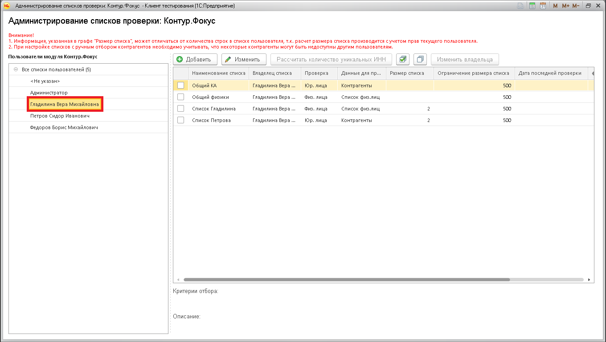
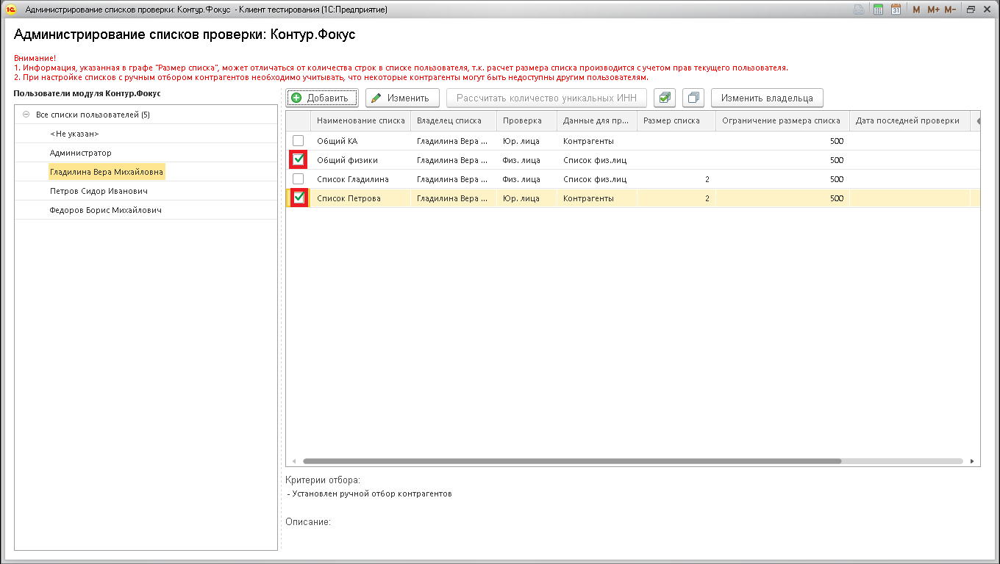
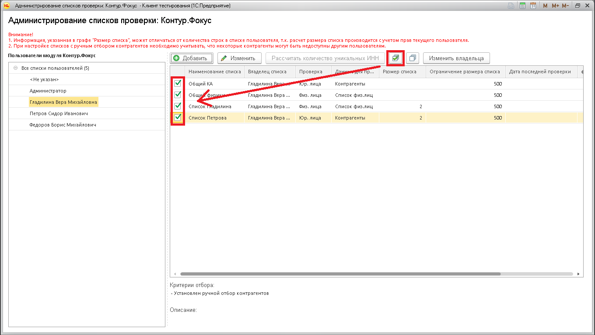
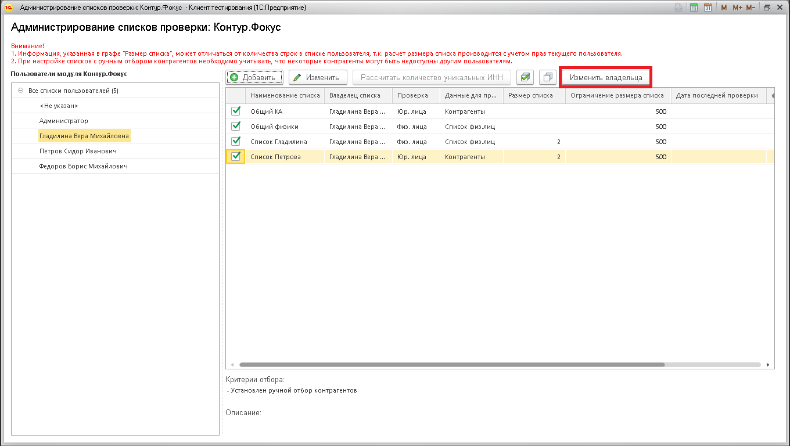
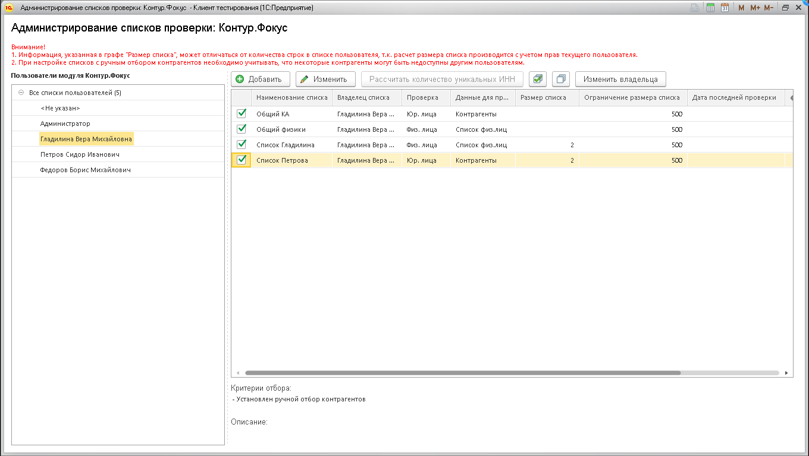
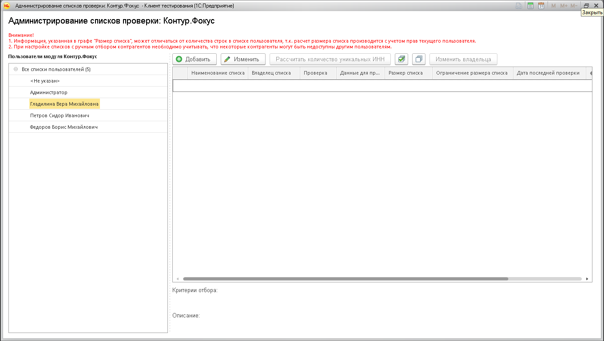
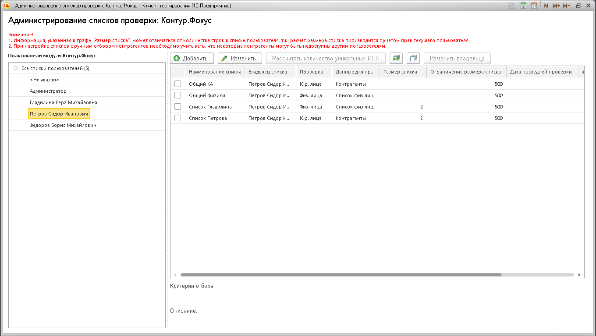

**Функционал:** Групповое изменение владельца списков

**Сценарий:** Изменение владельца списков

	001. Перенесем списки пользователя Гладилина пользователю Петров.

	002. Можно изменить владельца у конкретных списков...

	003. ...а можно выбрать все списки пользователя.

	004. Нажимаем кнопку "Изменить владельца".

	005. Выбираем пользователя Петров в качестве нового владельца списков.

	006. У пользователя Гладилина не осталось ни одного списка проверки.

	007. Проверим, что списки перенеслись пользователю Петров.

