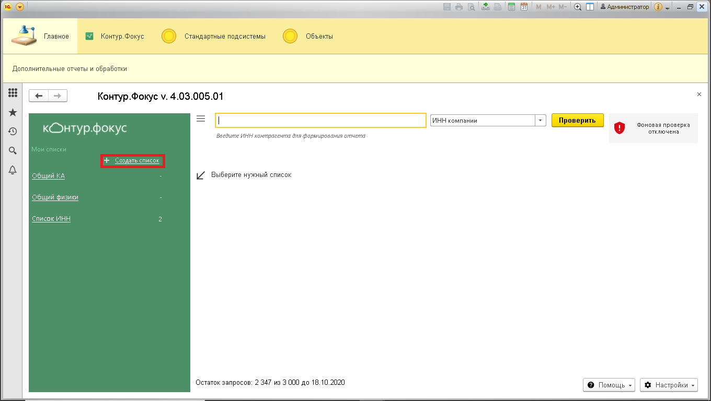
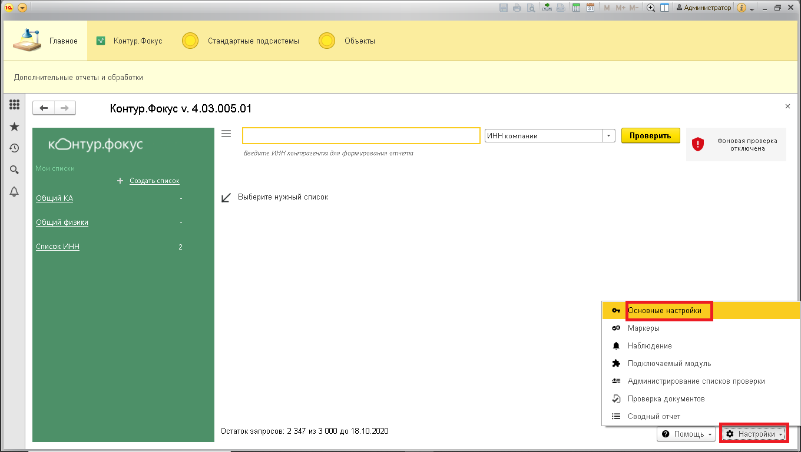
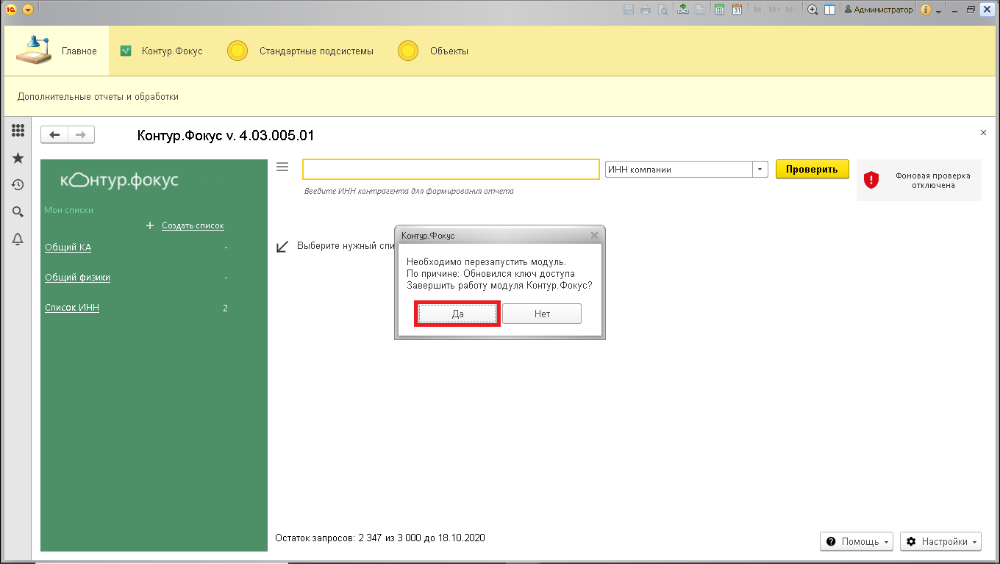
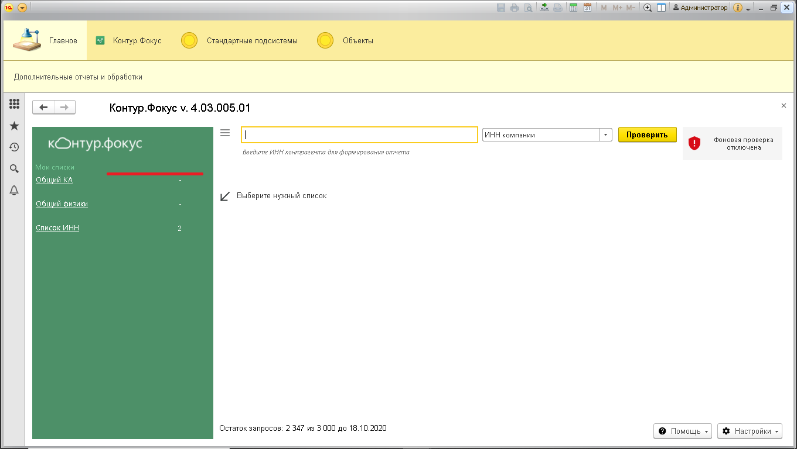
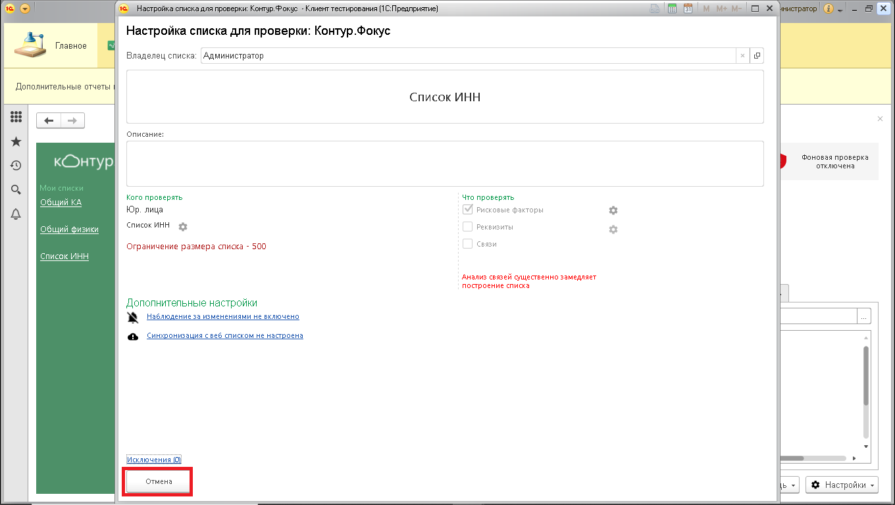
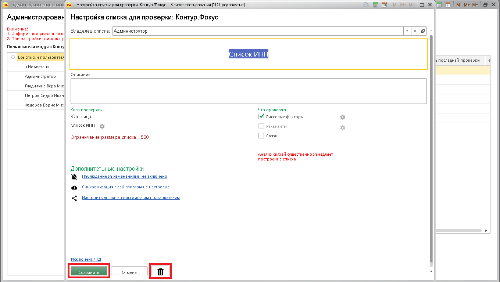

**Функционал:** Дополнительные настройки

> По-умолчанию всем пользователям разрешено создавать и редактировать свои списки проверки.

> Также, у пользователей которые запускают модуль впервые на основании анализа базы создаются списки по-умолчанию.

> Для того чтобы запретить создавать и редактировать списки пользователям необходимо отключить настройку "Разрешить настройку списков из панели списков".

**Сценарий:** Запрет на создание и изменение списков проверки пользователями

	1.   Откроем модуль. Пользователям разрешено создавать и редактировать списки проверки.

	1.   Откроем основные настройки модуля.

	1.   Снимем флаг "Разрешить настройку списков из панели списков".

	1.   Сохраним настройки и перезапустим модуль

	1.   Запустим модуль Контур.Фокус. Видно, что из панели списков пропала возможность создания списков.

	1.   Откроем окно настроек списка проверки и убедимся, что список запрещено редактировать.

	1.   Откроем список через панель администрирования. Список доступен для редактирования.

