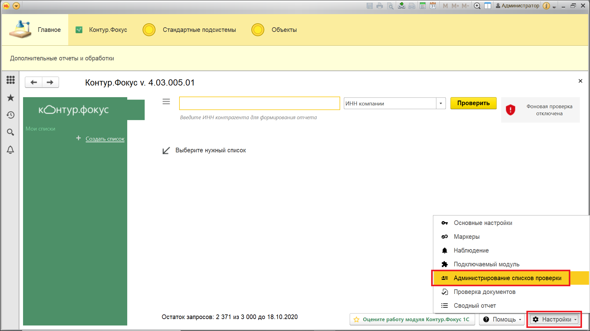
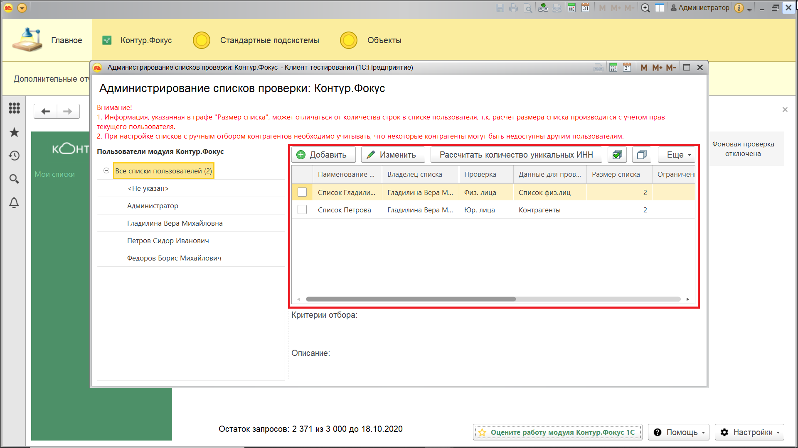
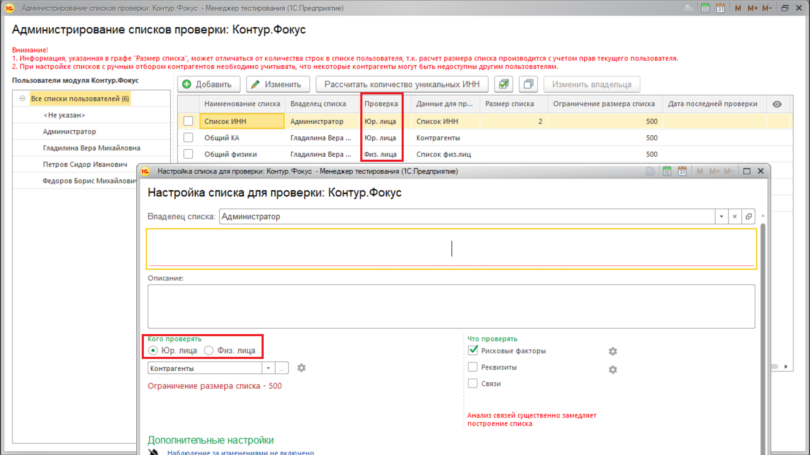
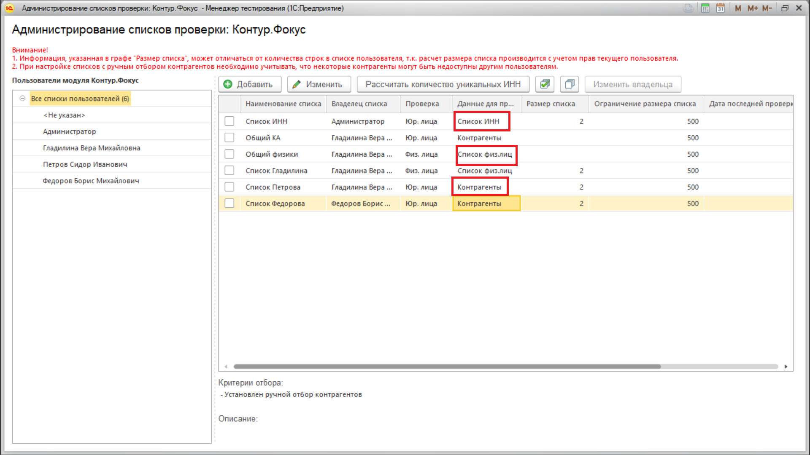
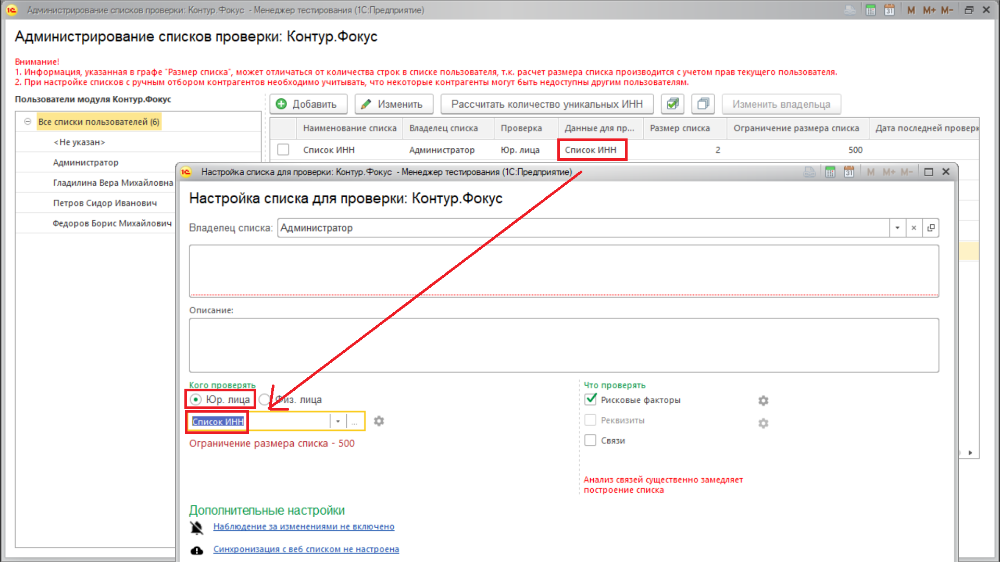
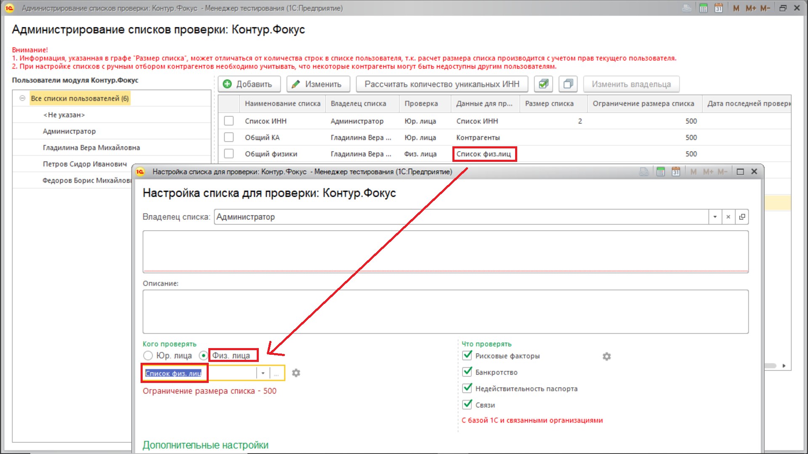
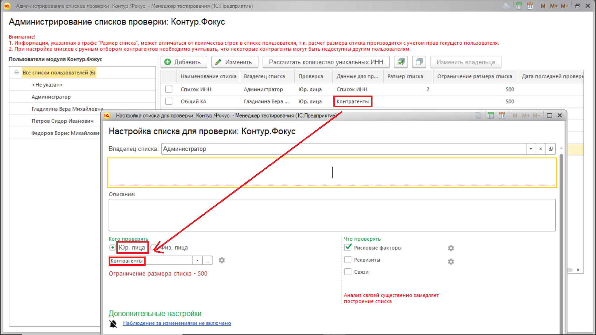
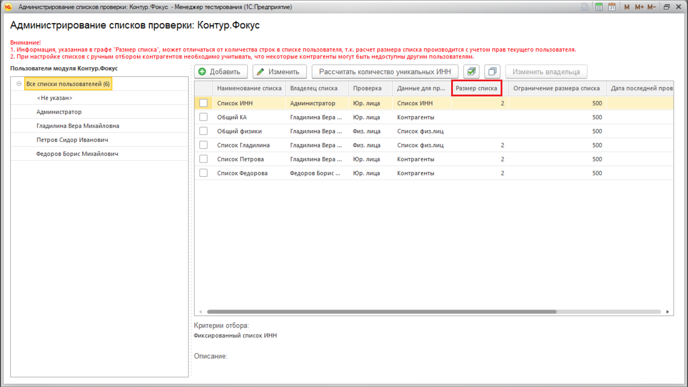

**Функционал:** Панель "Администрирование списков проверки"

> Администрирование списков проверки предназначено для централизованного управления списками всех пользователей. Администрирование  производится через панель "Администрирование списков проверки". В функцонал панели входит:

> - создание и удаление списков

> - изменение настроек списка

> - изменение владельца списка (в том числе, у нескольких списков одновременно)

> - открытие доступа к списку другим пользователям.

> Панель доступна пользователю с полными правами или с включенной ролью "Администратор (Контур.Фокус)". 

**Сценарий:** Открытие панели "Администрирование списков проверки" под пользователем Администратор

	001. Откроем панель через меню "Настройки" - "Администрирование списков проверки".

	002. В левой части панели расположен фильтр по пользователям.

	003. В правой части - отображаются доступные выбранному пользователю списки, а также панель действий над списками.

	004. При открытии панели отображаются списки всех полльзователей.

**Сценарий:** Описание некоторых колонок панели "Администрирование списков проверки"

	005. Колонка панели "Проверка" соответствует реквизиту "Тип проверки" окна настройки списка проверки.

	006. Графа "Данные для проверки" может принимать одно из трех значений.

	007. Значение "Список ИНН" соответствует настройке: 

	008. Значение "Список физ.лиц" соответствует настройке: 

	009. Во всех оставшихся случах будет значение "Контрагенты".

	010. В колонке "Размер списка" выводится количество отображаемых в списке пользователя строк.

> Значения в данной колонке рассчитаны с учетом прав и настроек текущего пользователя. Поэтому, реальное число строк может быть больше указанного в колонке.

