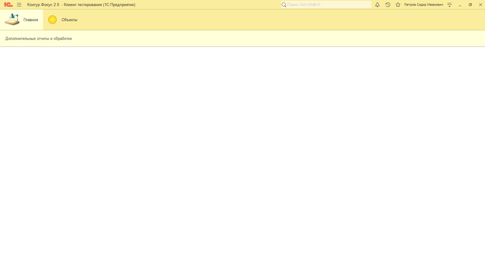
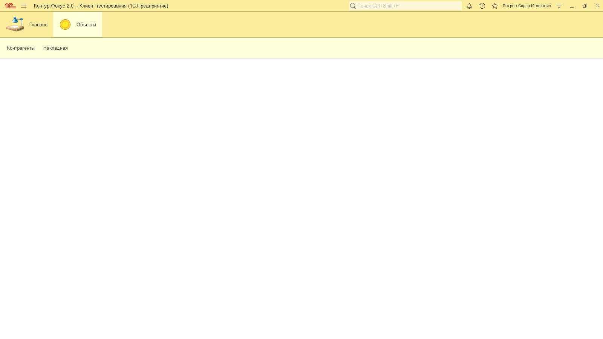
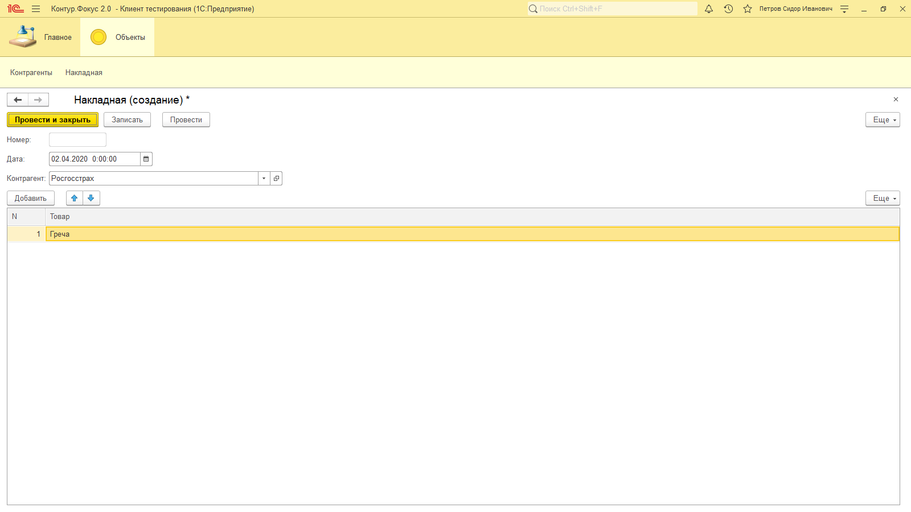
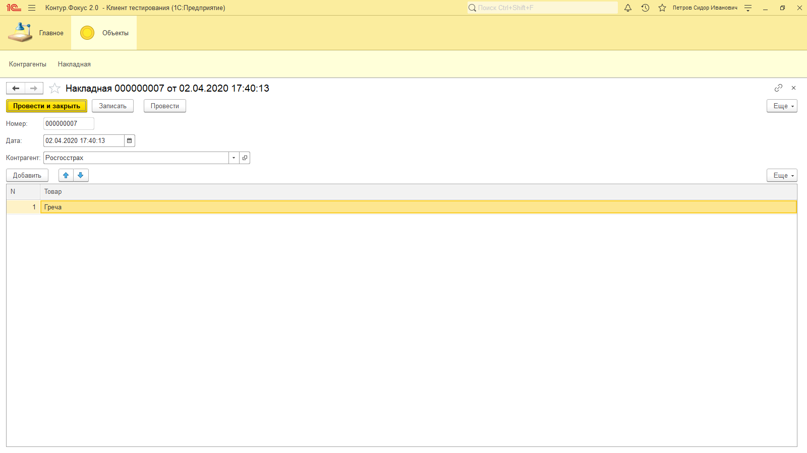
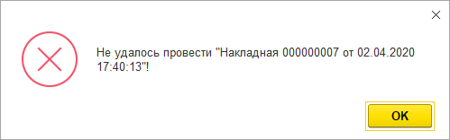
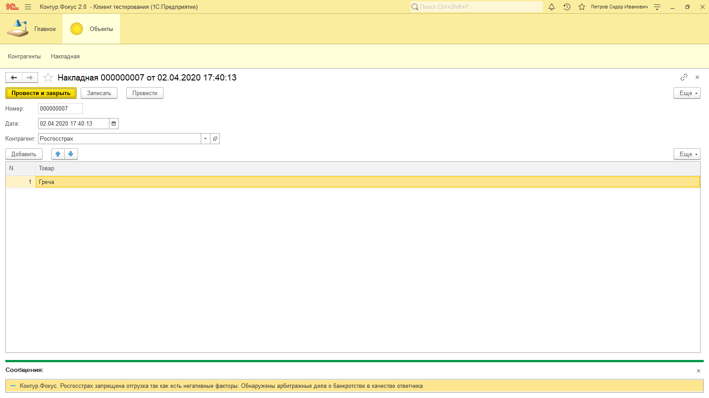

**Функционал:** Блокировка операций

 > В момент проведения документа Контрагент будет проверен через Контур.Фокус

 > В случае обнаружения стоп-факторов операция будет заблокирована

**Сценарий:** При оформлении документа срабатывает блокировка

	001. Обратите внимание. Модуль Контур.Фокус не запущен

	002. Менеджер создает документ

	003. Документ можно записать

	004. Запись документа по-умолчанию не блокируется

	005. Проведение документа блокируется

	006. И пользователю сообщена причина блокировки

