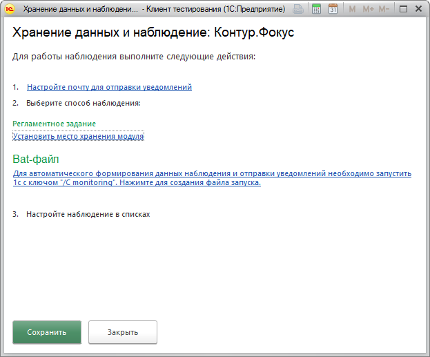
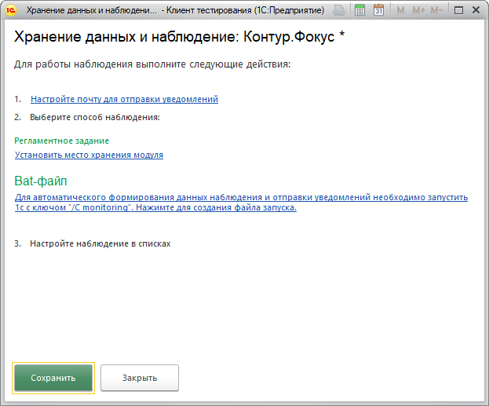
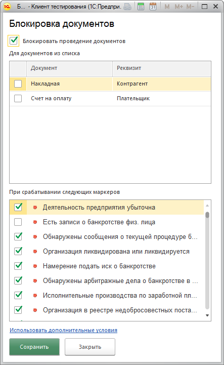
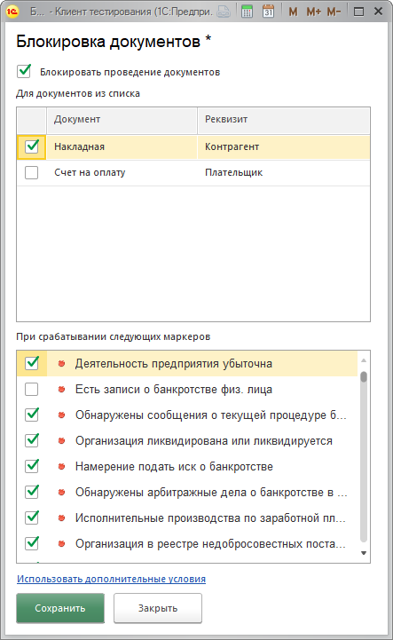
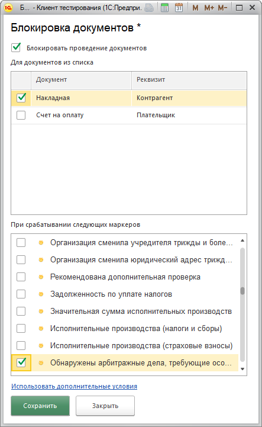

**Функционал:** Возможнсть запретить выполение операций по стоп-факторам

 > ВНИМАНИЕ! Все настройки выполняются пользователем с административными правами

**Сценарий:** Настройка местоположения модуля

	001. Укажем где находится модуль Контур.Фокус

	002. В меню Настройки выбираем пункт Наблюдение

	003. Нажимаем кнопку "Установить место хранения модуля"

	004. Пусть модуль добавлен в справочник Дополнительные обработки

	005. Вот так выглядить установленная настройка

	006. Сохраним настройки

**Сценарий:** Настройка модуля для проверки документов

	001. Включим проверку документов при проведении

	002. В меню Настройки выбираем пункт Проверка документов

	003. Включаем блокировку проведения по стоп=факторам

	004. Укажем какие документы проверять

	005. Можно изменить список маркеров которые считаются стоп-фактором

Видео

<iframe width="1280" height="720"
  src="https://www.youtube.com/embed/MaCJtkSlreE">
</iframe>
