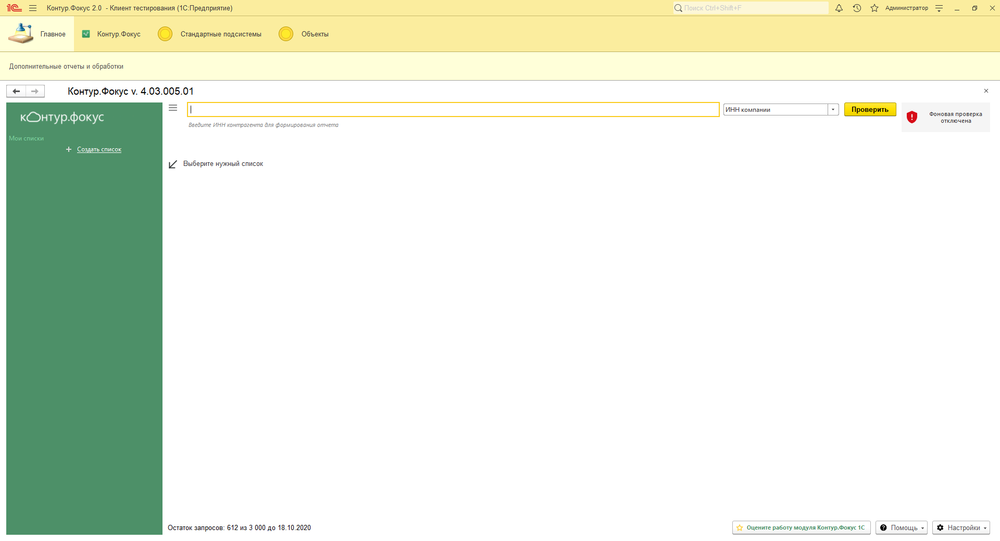
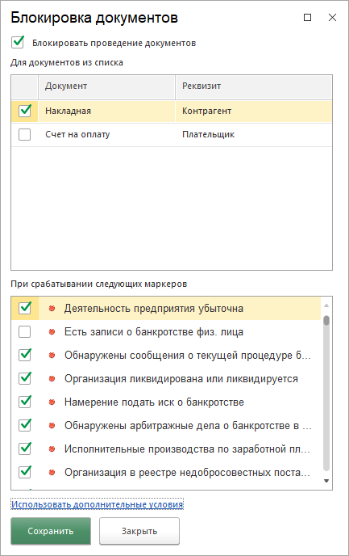
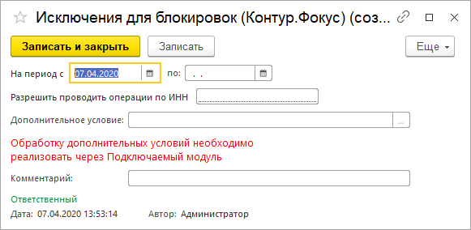
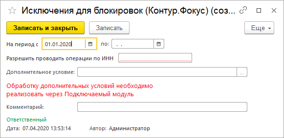
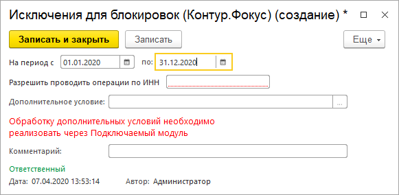
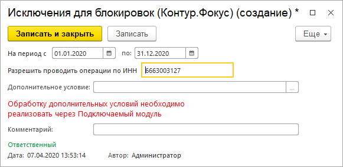
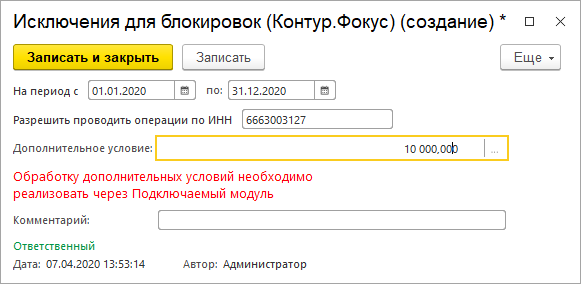
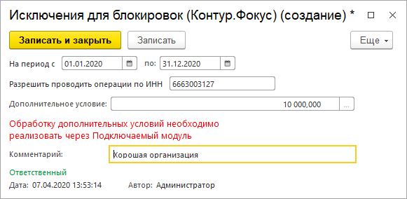
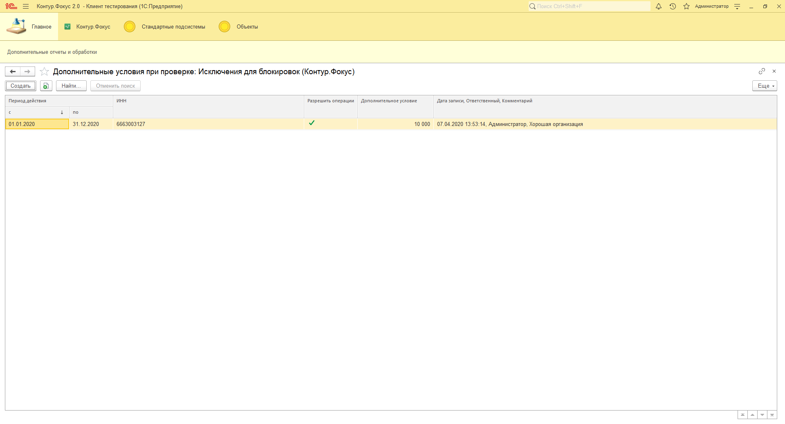

**Функционал:** Настройка исключений блокировки

 > Бывает что по клиенту все-таки надо оформить операцию.

 > Тогда есть несколько способов это сделать:

 > 1. Пользователи с ролью Фокус_Администратор могут выполнять операцию без проверки.

 > 2. Настроить список исключений ИНН.

**Сценарий:** Настройка исключений блокировки

	001. В меню Настройки выбираем пункт Проверка документов

	002. И выбираем Использовать дополнительные условия

	003. Эта форма с условиями, когда разрешить операции

	004. Создаем новое условие. Допустим разрешим в течении года

	005. Указываем период когда действует разрешение

	006. Дату "по" можно не указывать. Тогда разрешаем навсегда

	007. Указываем ИНН компании

	008. В поле Дополнительное условие можно ввести произвольные данные. Например, сумму документа, до которой можно отгружать. Обработку этих условий надо реализовывать в Подключаемом модуле

	009. Можно указать произвольный комментарий. Чтобы потом проще было вспомнить почему разрешили операцию

	010. Сохраняем настройки

	011. Теперь операции по данной организации разрешены, даже если возникнут стоп-факторы

