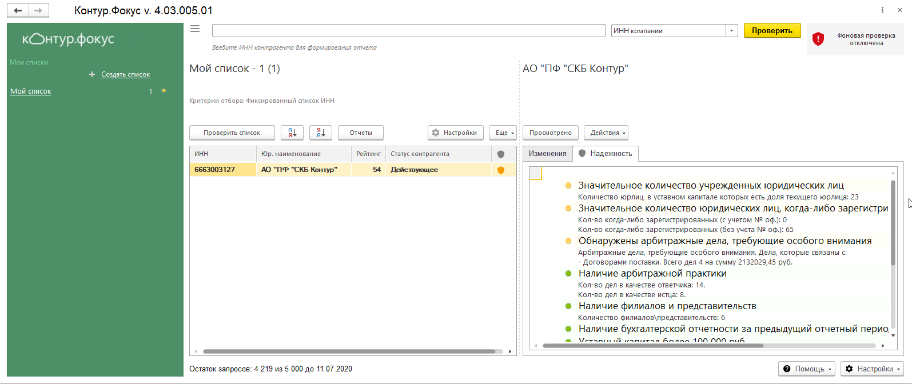

# Модуль

Модуль  проверяет  надежность  контрагентов  непосредственно в 1С, отслеживает изменения надежности и реквизитов. 
Позволяет создавать и настраивать списки контрагентов по интересующим критериям для последующего наблюдения за ними.

